# Project 9 - Creating Honeypots

Time spent: **27** hours spent in total

> Objective: Create multiple honeypots and monitor the activity.

## Approach, resources/tools used, findings
Following the CodePath tutorial I created the mhn-admin VM and mhn-honepot VM.  
I used https://github.com/RedolentSun/mhn.git GitHub project to create the honeypot network.  
I run the following script in the honepot VMs:
- mhn-honeypot&nbsp;&nbsp;&nbsp;&nbsp;= Ubuntu - Snort
- mhn-honeypot-1 = Ubuntu - Dionaea with HTTP
- mhn-honeypot-2 = Ubuntu - p0f
- mhn-honeypot-3 = Ubuntu - Kippo as vulnerable Juniper Netscreen
- mhn-honeypot-4 = Ubuntu - Suricata
- mhn-honeypot-5 = Ubuntu - Dionaea
- mhn-honeypot-6 = Ubuntu - Amun

After running mhn-honeypot-3 instance for about 15 hours, I found out that I can no longer ssh into the VM.<br />  
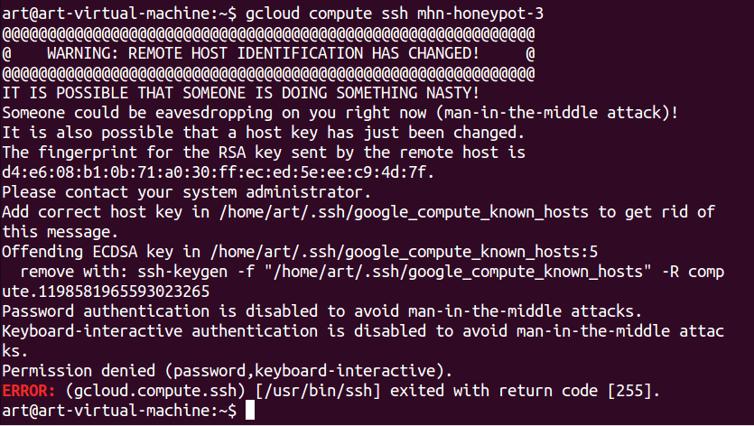<br />  
Most likely the instance was compromised.<br />
At the time of writing the report the number of attacks is: <b>24,168</b>.<br />
<b>Export of the data collected from honeypots: <a href="./logs/session.json">session.json</a></b>

## Reproducible honeypot setup
### Requirements
- OS: Ubuntu 14.04 (trusty)
- Cores: 1vCPU
- CPU platform: Intel Haswell
- Memory: 0.6 GB
- GCP VM Zone: us-central1-c
- Allowed Traffic: For admin VM - HTTP, HTTPS, SSH; For honeypot VM - all ports and all protocols
- At least two VMs - one is a honeypot, another is the hub that collects malware and logs
### Features
- The server running Modern Honey Network provides information about scan attemps, their time, IP, and geografical location.<br />
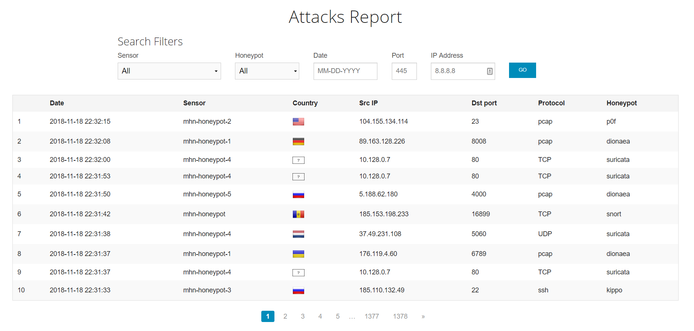<br />  
- Aditionaly it stores the payloads attempted to be uploaded and run on honeypot servers.
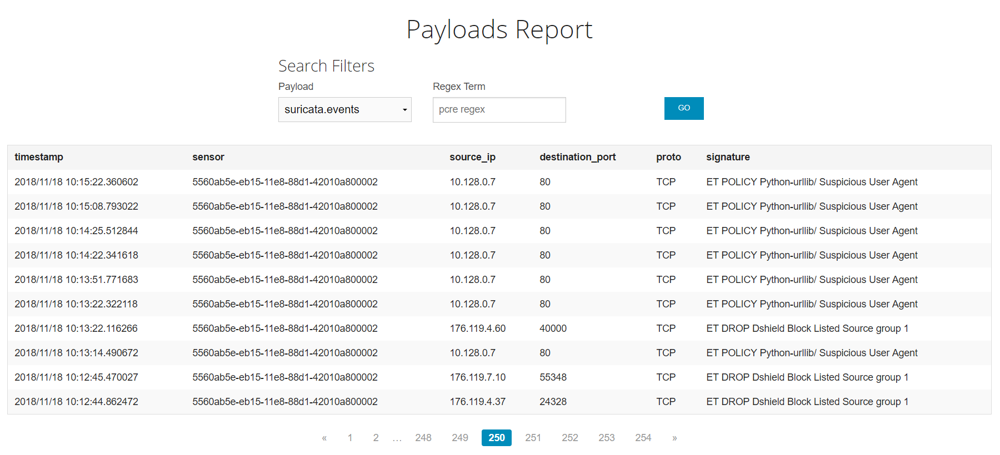<br /> 
### Setup script
There are three scripts that you would run to automate the setup:
- Run this script from your desctop with linux OS: <a href="./scripts/mhnUserMachine.sh">shell script</a>
### Steps to setup
- On the Ubuntu 14.04 installed Google Cloud SDK and connected to my account:  
```bash
export CLOUD_SDK_REPO="cloud-sdk-$(lsb_release -c -s)"
echo "deb http://packages.cloud.google.com/apt $CLOUD_SDK_REPO main" | sudo tee -a /etc/apt/sources.list.d/google-cloud-sdk.list
curl https://packages.cloud.google.com/apt/doc/apt-key.gpg | sudo apt-key add -
sudo apt-get update && sudo apt-get install google-cloud-sdk
gcloud init
```
- After running ```gcloud init``` select defalut region and zone to be ```us-central1``` and ```us-central1-c```<br />
- Created a firewall rule to allow trafic on ports 3000 and 10000<br />
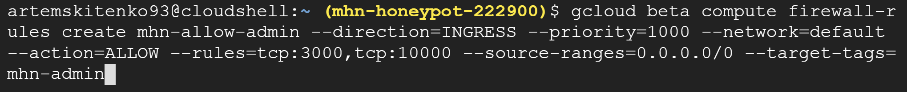<br />  
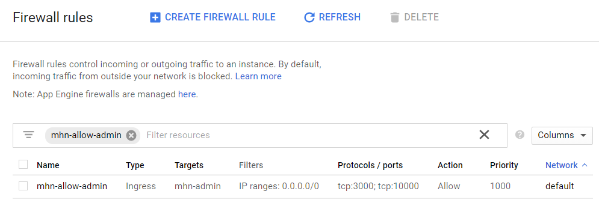<br />  
- Create admin server and ssh into it
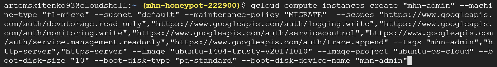<br />  
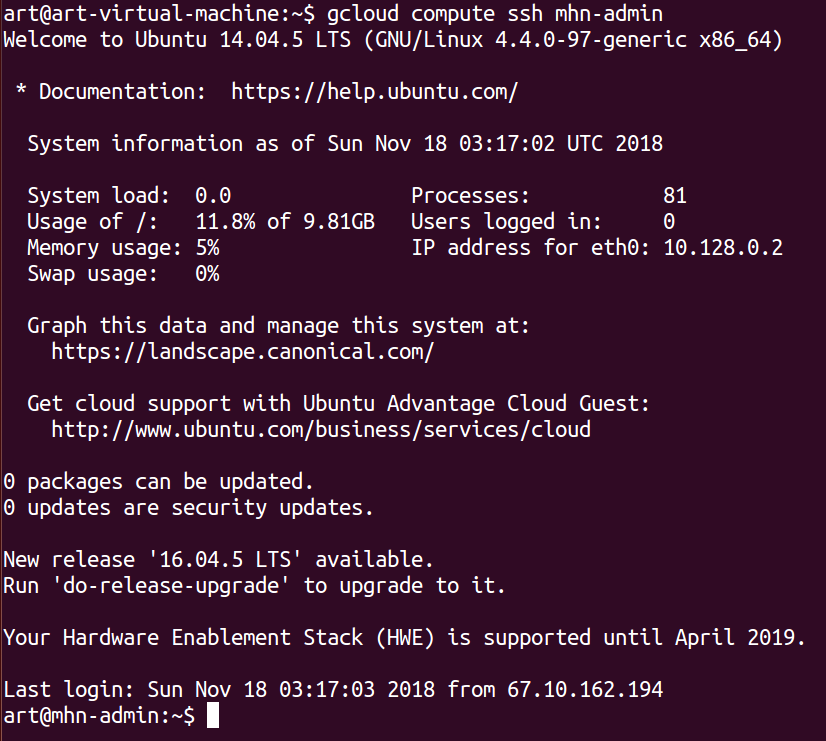<br />  
- Make mhn-admin VM ip static
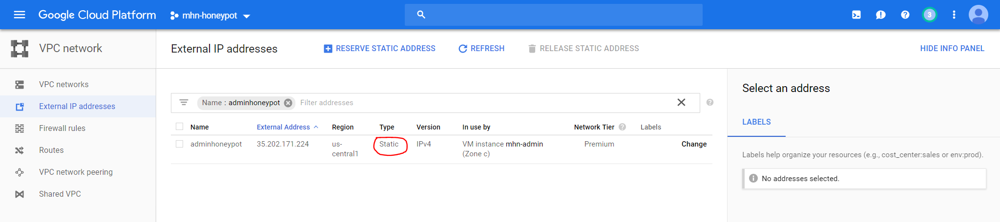<br />  
- Run the following commands from the admin VM shell:
    ```bash
    sudo apt-get update
    sudo apt-get install git -y
    cd /opt
    sudo git clone https://github.com/RedolentSun/mhn.git
    cd mhn
    cd scripts/
    sudo nano ./install_hpfeeds.sh
    ```
    Change the line  
    ```pip install -e git+https://github.com/HurricaneLabs/pyev.git#egg=pyev```  
    to  
    ```pip install -e git+https://github.com/couozu/pyev.git#egg=pyev```  
    save it and run the install script in mhn folder
    ```bash
    cd ../
    $ sudo ./install.sh
    ```
- Create honepot VM and ssh into it<br />  
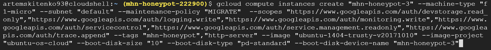<br />  
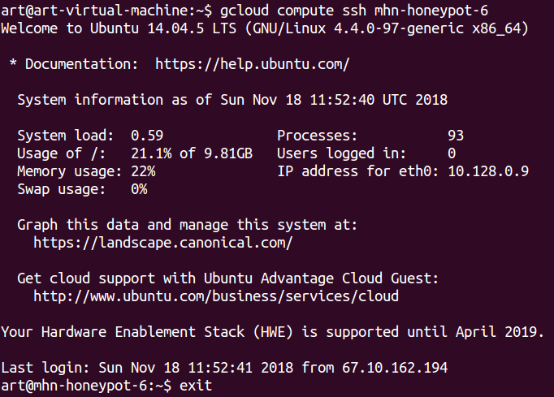<br />  
- In the admin server web interface click deploy
- Select script
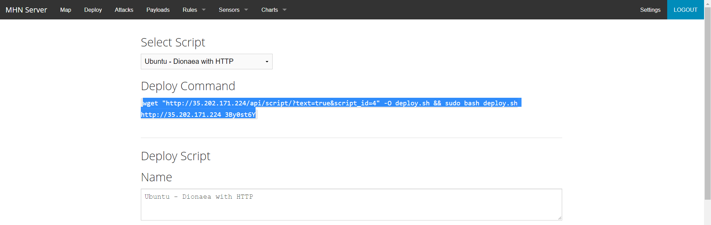<br />  
- Copy the command and run it in the honepot instance shell
- After some time you will have some traffic logs display in the admin server web interface Attacks tab

## Optional: Features
### Honeypot 
#### HTTPS enabled
SSL setup is based on the tutorial https://www.digitalocean.com/community/tutorials/how-to-create-an-ssl-certificate-on-nginx-for-ubuntu-14-04
```bash
sudo mkdir /etc/nginx/ssl
cd nginx/
cd ssl/
sudo openssl req -x509 -nodes -days 365 -newkey rsa:2048 -keyout /etc/nginx/ssl/nginx.key -out /etc/nginx/ssl/nginx.crt
cd /etc/nginx/sites-available
sudo nano default
```
- Edit the file default to look like this and save the changes
```text
server {
    listen       443 ssl;
    server_name  _;
    ssl_certificate /etc/nginx/ssl/nginx.crt;
    ssl_certificate_key /etc/nginx/ssl/nginx.key;
    location / {
        try_files $uri @mhnserver;
    }

    root /opt/www;

    location @mhnserver {
      include uwsgi_params;
      uwsgi_pass unix:/tmp/uwsgi.sock;
    }

    location  /static {
      alias /opt/mhn/server/mhn/static;
    }
}
```
- Restart the service
```bash
sudo service nginx restart
```
- Result:
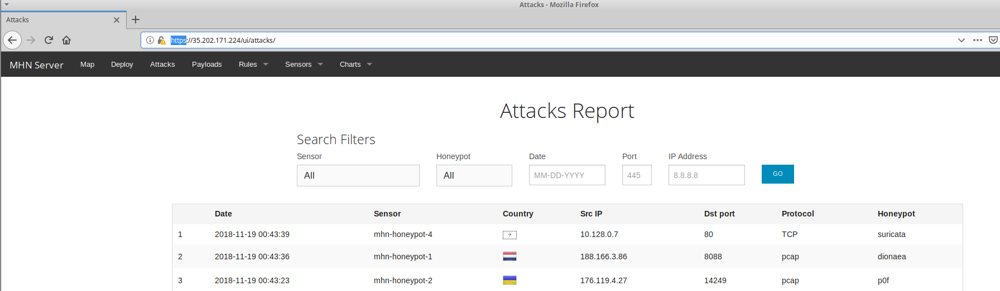<br />  
P.S. My ssh key setup:<br />
```text
Country Name (2 letter code) [AU]:US
State or Province Name (full name) [Some-State]:Texas
Locality Name (eg, city) []:San Antonio
Organization Name (eg, company) [Internet Widgits Pty Ltd]:week9
Organizational Unit Name (eg, section) []:art
Common Name (e.g. server FQDN or YOUR name) []:35.202.171.224
Email Address []:bigbossofgarena@gmail.com
```
#### Database back-end
Here are the contents of the database of mhn-honepot-1 that run Ubuntu - Dionaea with HTTP script: <a href="./SQLite/logsql.sqlite">logsql.sqlite</a>
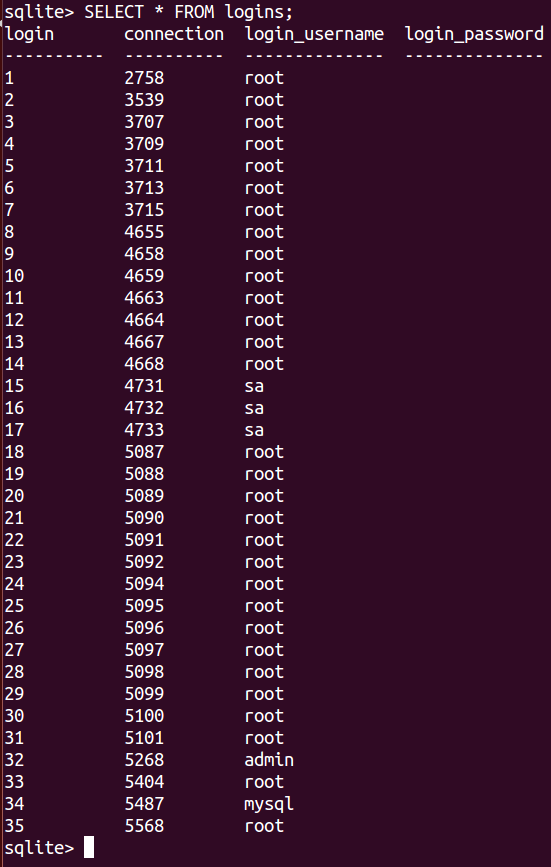<br />  
To see the contents of the file run the following commands:
```bash
sudo apt-get install sqlite
sudo sqlite3 -column -header logsql.sqlite
.open "./SQLite/logsql.sqlite";
.tables
SELECT * FROM logins;
```
### Demonstration 
Tools used for the attack: ZenMap, Sqlmap, OWASP ZAP.<br />  

ZenMap results:
```text
Nmap scan report for 135.196.239.35.bc.googleusercontent.com (35.239.196.135)
Host is up (0.048s latency).
Not shown: 988 closed ports
PORT     STATE    SERVICE      VERSION
21/tcp   open     ftp          Dionaea honeypot ftpd
|_ftp-anon: ERROR: Script execution failed (use -d to debug)
22/tcp   open     ssh          OpenSSH 6.6.1p1 Ubuntu 2ubuntu2.8 (Ubuntu Linux; protocol 2.0)
| ssh-hostkey: 
|   1024 78:e5:8a:bb:5e:55:dc:aa:66:37:c6:90:81:6f:df:f0 (DSA)
|   2048 14:79:82:7e:5a:26:e2:07:99:00:a0:3c:4d:fb:51:c3 (RSA)
|   256 e7:87:d5:0e:fd:c8:33:0d:32:d1:15:87:35:c2:4b:58 (ECDSA)
|_  256 90:2d:bb:2f:6b:98:03:5f:fe:e6:8f:00:4f:a0:4e:c9 (EdDSA)
42/tcp   open     nameserver?
80/tcp   open     honeypot     Dionaea Honeypot httpd
| http-methods: 
|_  Supported Methods: OPTIONS GET HEAD POST
|_http-title: Site doesn't have a title.
135/tcp  open     msrpc?
443/tcp  open     ssl/honeypot Dionaea Honeypot httpd
| http-methods: 
|_  Supported Methods: OPTIONS GET HEAD POST
|_http-title: Site doesn't have a title.
| ssl-cert: Subject: commonName=Nepenthes Development Team/organizationName=dionaea.carnivore.it/countryName=DE
| Issuer: commonName=Nepenthes Development Team/organizationName=dionaea.carnivore.it/countryName=DE
| Public Key type: rsa
| Public Key bits: 2048
| Signature Algorithm: md5WithRSAEncryption
| Not valid before: 2018-11-18T07:33:17
| Not valid after:  2019-11-18T07:33:17
| MD5:   60be a4eb 098b d952 0f04 ab84 ad46 d7dc
|_SHA-1: 8975 66e2 0e0e 5e26 6e5e 696a b784 b574 9495 185c
|_ssl-date: TLS randomness does not represent time
445/tcp  open     microsoft-ds Windows XP microsoft-ds
514/tcp  filtered shell
1433/tcp open     ms-sql-s     Microsoft SQL Server 2000 8.00.528.00; SP1+
3306/tcp open     mysql        MySQL 5.0.54
| mysql-info: 
|   Protocol: 10
|   Version: 5.0.54
|   Thread ID: 1729232896
|   Capabilities flags: 41516
|   Some Capabilities: SupportsCompression, ConnectWithDatabase, SupportsTransactions, LongColumnFlag, Support41Auth, Speaks41ProtocolNew
|   Status: Autocommit
|_  Salt: aaaaaaaa            
5060/tcp open     sip          (SIP end point; Status: 200 OK)
| fingerprint-strings: 
|   SIPOptions: 
|     SIP/2.0 200 OK
|     Allow: REGISTER, OPTIONS, INVITE, CANCEL, BYE, ACK
|     Accept: application/sdp
|     CSeq: 42 OPTIONS
|     Call-ID: 50000
|     sip:nm2@nm2
|     Accept-Language: en
|     Via: SIP/2.0/TCP nm;branch=foo
|     From: sip:nm@nm;tag=root
|     Contact: sip:nm2@nm2
|_    Content-Length: 0
|_sip-methods: REGISTER, OPTIONS, INVITE, CANCEL, BYE, ACK
5061/tcp open     ssl/sip      (SIP end point; Status: 200 OK)
| fingerprint-strings: 
|   SIPOptions: 
|     SIP/2.0 200 OK
|     Allow: REGISTER, OPTIONS, INVITE, CANCEL, BYE, ACK
|     Accept: application/sdp
|     CSeq: 42 OPTIONS
|     Call-ID: 50000
|     sip:nm2@nm2
|     Accept-Language: en
|     Via: SIP/2.0/TCP nm;branch=foo
|     From: sip:nm@nm;tag=root
|     Contact: sip:nm2@nm2
|_    Content-Length: 0
| ssl-cert: Subject: commonName=Nepenthes Development Team/organizationName=dionaea.carnivore.it/countryName=DE
| Issuer: commonName=Nepenthes Development Team/organizationName=dionaea.carnivore.it/countryName=DE
| Public Key type: rsa
| Public Key bits: 2048
| Signature Algorithm: md5WithRSAEncryption
| Not valid before: 2018-11-18T07:33:17
| Not valid after:  2019-11-18T07:33:17
| MD5:   f31d ae94 9b89 835c 65c2 5d57 ce0b 6e8f
|_SHA-1: 1461 4d51 0768 8c5c 4840 4fc2 29f0 f88e 918a fd58
|_ssl-date: TLS randomness does not represent time
2 services unrecognized despite returning data. If you know the service/version, please submit the following fingerprints at https://nmap.org/cgi-bin/submit.cgi?new-service :
==============NEXT SERVICE FINGERPRINT (SUBMIT INDIVIDUALLY)==============
SF-Port5060-TCP:V=7.60%I=7%D=11/18%Time=5BF228B9%P=x86_64-pc-linux-gnu%r(S
SF:IPOptions,10A,"SIP/2\.0\x20200\x20OK\r\nAllow:\x20REGISTER,\x20OPTIONS,
SF:\x20INVITE,\x20CANCEL,\x20BYE,\x20ACK\r\nAccept:\x20application/sdp\r\n
SF:CSeq:\x2042\x20OPTIONS\r\nCall-ID:\x2050000\r\nTo:\x20sip:nm2@nm2\r\nAc
SF:cept-Language:\x20en\r\nVia:\x20SIP/2\.0/TCP\x20nm;branch=foo\r\nFrom:\
SF:x20sip:nm@nm;tag=root\r\nContact:\x20sip:nm2@nm2\r\nContent-Length:\x20
SF:0\r\n\r\n");
==============NEXT SERVICE FINGERPRINT (SUBMIT INDIVIDUALLY)==============
SF-Port5061-TCP:V=7.60%T=SSL%I=7%D=11/18%Time=5BF228C0%P=x86_64-pc-linux-g
SF:nu%r(SIPOptions,10A,"SIP/2\.0\x20200\x20OK\r\nAllow:\x20REGISTER,\x20OP
SF:TIONS,\x20INVITE,\x20CANCEL,\x20BYE,\x20ACK\r\nAccept:\x20application/s
SF:dp\r\nCSeq:\x2042\x20OPTIONS\r\nCall-ID:\x2050000\r\nTo:\x20sip:nm2@nm2
SF:\r\nAccept-Language:\x20en\r\nVia:\x20SIP/2\.0/TCP\x20nm;branch=foo\r\n
SF:From:\x20sip:nm@nm;tag=root\r\nContact:\x20sip:nm2@nm2\r\nContent-Lengt
SF:h:\x200\r\n\r\n");
Aggressive OS guesses: Actiontec MI424WR-GEN3I WAP (99%), DD-WRT v24-sp2 (Linux 2.4.37) (97%), Linux 3.2 (97%), Microsoft Windows XP SP3 or Windows 7 or Windows Server 2012 (96%), Linux 4.4 (96%), Microsoft Windows XP SP3 (96%), BlueArc Titan 2100 NAS device (91%)
No exact OS matches for host (test conditions non-ideal).
Network Distance: 2 hops
TCP Sequence Prediction: Difficulty=256 (Good luck!)
IP ID Sequence Generation: Incremental
Service Info: OS: Linux; CPE: cpe:/o:linux:linux_kernel

Host script results:
|_clock-skew: mean: -19h35m56s, deviation: 0s, median: -19h35m56s
| ms-sql-info: 
|   35.239.196.135:1433: 
|     Version: 
|       name: Microsoft SQL Server 2000 SP1+
|       number: 8.00.528.00
|       Product: Microsoft SQL Server 2000
|       Service pack level: SP1
|       Post-SP patches applied: true
|_    TCP port: 1433
| smb-os-discovery: 
|   OS: Windows XP (Windows 2000 LAN Manager)
|   OS CPE: cpe:/o:microsoft:windows_xp::-
|   NetBIOS computer name: HOMEUSER-3AF6FE\x00
|   Workgroup: WORKGROUP\x00
|_  System time: 2018-11-18T08:33:17+01:00
| smb-security-mode: 
|   account_used: guest
|   authentication_level: user
|   challenge_response: supported
|_  message_signing: disabled (dangerous, but default)
|_smb2-time: Protocol negotiation failed (SMB2)
```
The rest of the tools did not give any useful results. For example, Sqlmap wasn't able to continue scanning because the page returned 404 code, OWASP ZAP scan yielded only a few warnings about XSS Protection Not Enabled on robots.txt and sitemap.xml files and missing X-Content-Type-Options and Content-Type headers, no critical vulnerabilities were found.
#### Captured malicious payload
Here are the samples of bisteream payloads uploaded to mhn-honepot-1 that run Ubuntu - Dionaea with HTTP script: <a href="./dionea-payloads/Dionaea-payloads.tar.gz">Dionaea-payloads.tar.gz</a><br />  
Stored payloads: 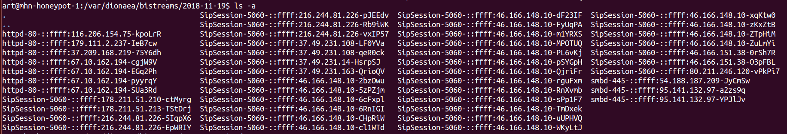<br />  
Snort alerts: 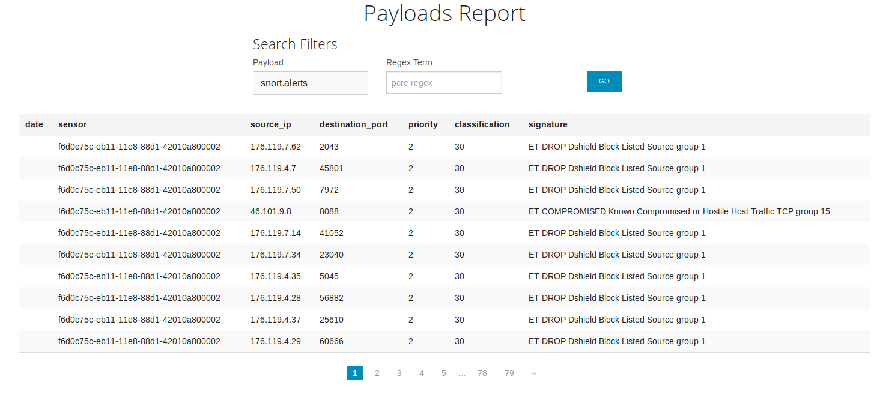<br />  
Suricata events: 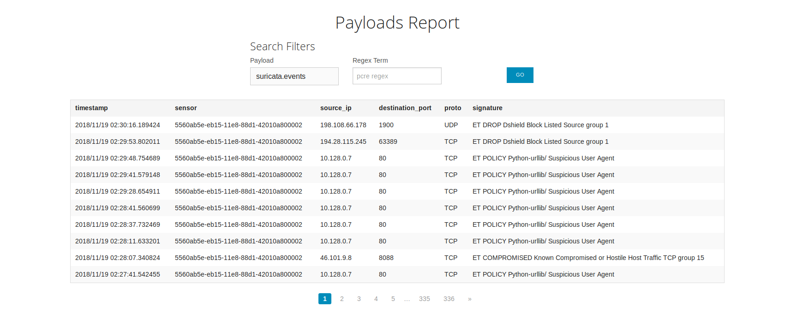<br />  